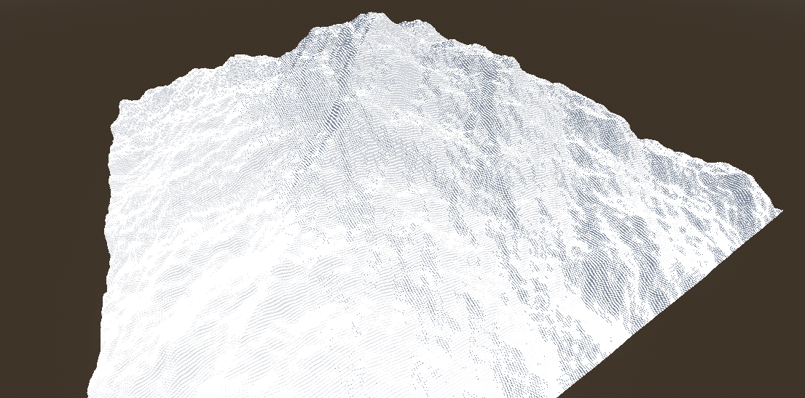
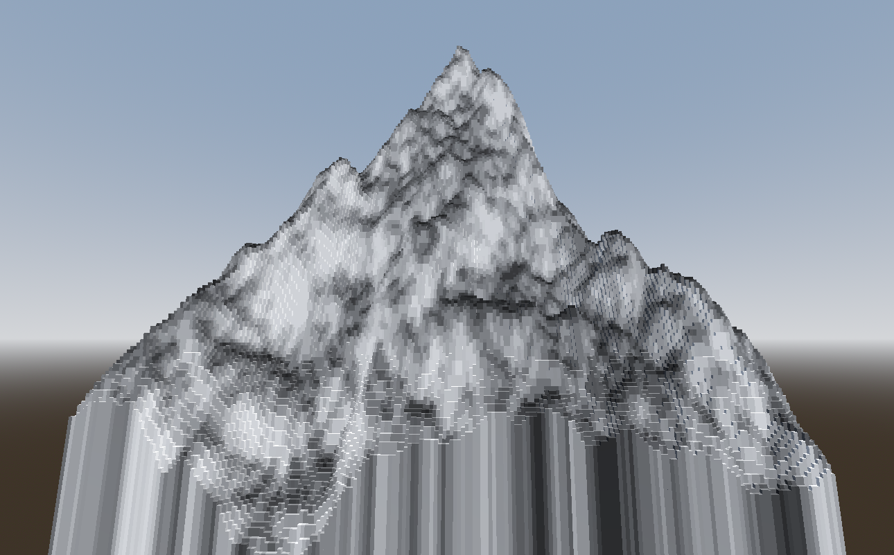
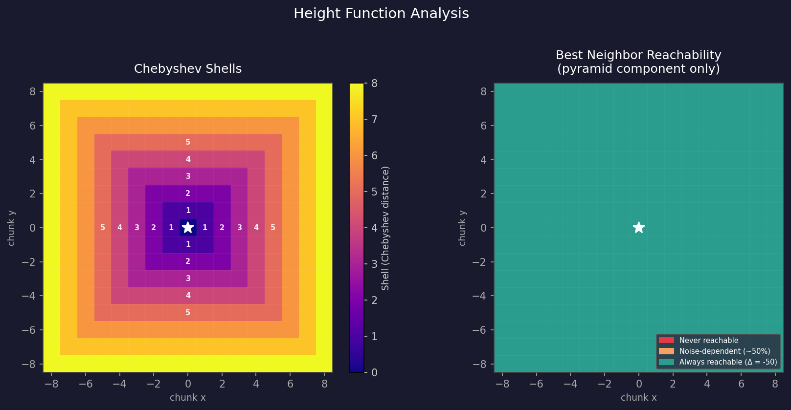

# Devlog 1: WorldGen

---

# Introduction
While working on the first iteration of this project, I stumbled upon a big problem: "*How can I make a random-ish world generation system that creates paths on an infinite 2d square grid which can fork (but never merge) and assure that **the path will always be able to expand?***"

This can be trickier than it initially seems. If no constraints are applied, paths can (and eventually will) weave in such a manner that block themselves or other paths from expanding more. Even if we check in a radius around our paths, if we want to make an infinite grid, no one can assure that a path 50000km away is blocking the expansion ahead, we would need infinite computing power.

# My solution
Since the objective was to generate large grids of paths, ideally I needed something which could create paths in constant time (the time the system needs to create a new path is always the same, no matter the size of the grid).

I got inspired by mountains and rivers to make my solution: A class in my code creates a height map that can be accessed by providing a set of coordinates, getting the height on that specific spot. Using these values, paths can extend like rivers, "falling down the mountain". This creates a constant time solution, but it still needs some tweaking to achieve consistency, since there is still a chance paths will stop each other.


*First iteration of the procedural height map*

I started by creating a simple pyramid shape using this code:

```gdscript
var h: int = -max(abs(coords.x), abs(coords.y))
```

Notice that I used a max() function, which results in a pyramid shape. This is due to the fact that when working in a square grid, projecting a pyramid into a 2d plane makes for more natural paths, due to the grid geometry. 

Secondly, I needed some kind of noise to make the paths more interesting:

```gdscript
# Compute height at coordinates
func get_height(coords: Vector2i) -> int:
	# Base height decreases with distance from origin
	var h: int = -max(abs(coords.x), abs(coords.y)) * 50
	# Add 2D noise
	return h + noise.get_noise_2d(coords.x, coords.y) * 10
```

To achieve this, I created a tool which could render the height maps, so I could judge whether the noise pattern was right or not and started to tweak some values. 


*Second iteration of the procedural height map, brighter zones represent higher steepness*

When I got the noise to behave as I needed, I started to wonder how to ensure that paths won't ever stop each other from expanding. After some headaches, I realized that, I actually don't need to do that, I just need to **ensure that at least one path can expand**.

The solution I came up with is what I call "ghost chunks". Every time a path expands into a new chunk, it registers its potential next steps as ghosts: slots that don't exist yet, but are marked as reserved. This way, even if two paths are growing towards each other, neither will walk into the other's future space. The system doesn't need to look far ahead or compute anything global, it just checks its immediate neighbors. As long as a ghost exists somewhere in the world, the generation is guaranteed to keep going.

```gdscript
func _register_ghost(neighbor: Vector2i, entry_dir: Constants.Directions, depth: int) -> void:
	# Don't overwrite a real chunk
	if chunks.has(neighbor):
		return
	# Already reserved, nothing to do
	if ghost_chunks.has(neighbor):
		return
	# Mark the slot as reserved, storing where the path came from and how deep it is
	ghost_chunks[neighbor] = entry_dir
	ghost_depths[neighbor] = depth
```

Another feature I needed to implement is path branching. To control how often they do so, I implemented a simple token economy. The system starts with a negative token balance, meaning it literally can't afford to fork at the beginning, which forces the initial path to grow for a while before splitting. Every new chunk generated adds a token to the balance. Forking into a 3-way junction costs 100 tokens, and a 4-way costs 110. On top of the cost check, there's a probability roll that scales with how many tokens you have above the threshold, so forks become more likely the longer the path has been building up. This keeps the branching feeling organic rather than mechanical.

```gdscript
func _apply_fork_logic(
	dirs: Array[Constants.Directions],
	candidates: Array[Constants.Directions]
) -> Array[Constants.Directions]:
	candidates.shuffle()

	for candidate in candidates:
		# A 3-way junction costs less than a 4-way
		var exits_after: int = dirs.size()
		var cost: int = FORK_COST_3WAY if exits_after == 2 else FORK_COST_4WAY

		# Can't afford it, stop trying
		if expansion_tokens < cost:
			break

		# The more tokens above the threshold, the higher the fork chance (capped at 90%)
		var fork_prob: float = minf(0.5 + 0.25 * ((expansion_tokens / cost) - 1), 0.9)
		if randf() < fork_prob:
			dirs.append(candidate)
			expansion_tokens -= cost

		# Hard cap: one entry + three exits maximum
		if dirs.size() >= 4:
			break

	return dirs
```

The grid is divided into chunks, each one being a 3x3 block of cells. The reason for this is purely practical: a single cell is too small to draw a meaningful path through, and it makes the coordinate system much cleaner to work with. All the generation logic operates on chunk coordinates (simple integer pairs), while the rendering layer translates those into cell coordinates when it actually needs to paint something on screen. This separation makes it easy to change the visual scale of the world without touching any of the generation logic.


*Enemies following a generated path*


## Can paths ever get stuck?
It is critical that at no point does the player find themselves in a situation where all paths are blocked. Motivated by this, I decided to analyze the exact chance of such thing happening.

The height at any chunk coordinate is computed as:

```
h(c) = -max(|cx|, |cy|) × 50  +  noise(cx, cy) × 10
```

The first term creates a pyramid using [Chebyshev distance](https://en.wikipedia.org/wiki/Chebyshev_distance), dividing the grid into concentric "shells" around the origin. The second is a Ridged Simplex noise with domain warp. Since Ridged noise is always non-negative (computed as `1 - |simplex|`), its contribution after scaling sits in `[0, 10]`.


*Left: Chebyshev shells around the origin. Right: best neighbor reachability considering only the pyramid component.*

The height difference between adjacent chunks on different shells is always exactly `±50`, while the maximum noise delta between any two neighbors is `10`. So if a neighbor sits on a shell further from the origin, no noise value can make it reachable:

```
net delta (worst case) = +50 (pyramid) - 10 (max noise compensation) = +40
```

The pyramid gradient is always dominant across shell boundaries. Moving inward is always uphill, moving outward is always downhill, regardless of noise.

This means individual branches can and do die. A chunk whose free outward direction is occupied by another path becomes a dead end, which is expected. The noise creates same-shell neighbors (pyramid delta = `0`) where reachability is roughly 50/50, which is what gives paths their organic feel rather than expanding in clean rings.

The more interesting question is whether the network as a whole can block. Suppose, by contradiction, that every active ghost chunk has no reachable free neighbor. For any ghost at coordinates `C`, the direction further from the origin always has a pyramid delta of `0` or `-50`, so it is always reachable in terms of height. For it to be unavailable it would have to be occupied by another chunk or ghost, which faces the same situation. Since chunks are finite and the grid is infinite, this chain cannot loop back on itself and always terminates at a frontier with at least one free outward direction.

```
P(full network block) = 0
```

This holds for any noise configuration. The pyramid structure alone guarantees it, the noise only influences the shape and branching of the paths, never their ability to keep expanding.
