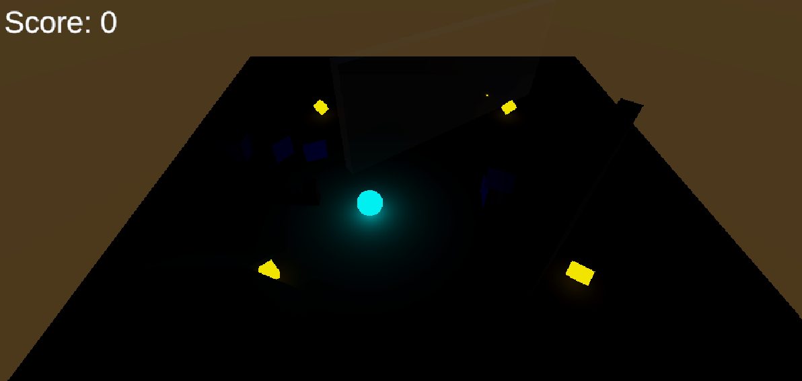

# Roll-a-Ball

---

# Introduction

For this project I started from Unity's **Roll-a-Ball** learning project. The original project is a small 3D game where the player controls a ball, collects pickups and wins after collecting them all. It is mainly focused on learning the basics of Unity: setting up a scene, scripting player movement, handling collisions, creating UI and using AI Navigation.

I wanted to push it a little further by changing the way the level is experienced rather than simply adding more mechanics. My goal was to make visibility and positioning matter.



# Darkness

The biggest change is that the level is almost completely dark. Instead of lighting the entire arena, I made the player and the pickups glow, making them the main visible elements in the scene.

This changes the original experience considerably. The player can always see themselves and the glowing pickups, but the enemy does not glow. When it is far away, its position is practically unknown.

The enemy still simply follows the player using Unity's navigation system, but the darkness makes knowing where it is part of the gameplay.

The result is a simple risk/reward loop: moving towards a pickup is necessary to progress, but doing so can also mean moving towards an enemy that you cannot currently see.

# The wall

I also added a large diagonal wall across the level. Rather than making it completely opaque, I gave it a transparent material.

This was mainly a gameplay decision. The wall divides the map and can hide the enemy, but the player can still look through it. This creates a safe way of checking the enemy's position before crossing into a dangerous area.

The wall can therefore be used as cover while still allowing the player to track the enemy. Since the enemy itself does not glow, seeing it through the wall becomes particularly valuable.

# Smoother camera

The original camera follows the player, but I wanted its movement to feel less rigid. I therefore added a small smoothing system where the camera moves towards its target instead of instantly matching the player's position.

```csharp
float distance = Vector3.Distance(player.transform.position + offset, transform.position);
Vector3 direction = (player.transform.position + offset - transform.position).normalized;
transform.position = transform.position + (Time.deltaTime * direction * math.pow(distance, 2));
```

Because the movement is based on the distance to the target, the camera reacts quickly when it falls far behind while becoming more subtle as it gets closer. This makes the camera feel more dynamic without changing how the player controls the ball.

# Final result

The final result is still recognizably Roll-a-Ball, but the focus has shifted from simply collecting every pickup to managing information. The player is constantly deciding where to move, what can be seen, and whether it is safe to approach the next objective.

The underlying systems are deliberately simple, but combining darkness, glowing objects, an invisible enemy and a transparent wall creates a much more tense experience from the same basic mechanics.
